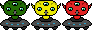
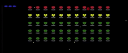

#  Invaders in Space - 2D Game
## About the Project 📖
_Invaders in Space_ is inspired by the classic arcade game _Space Invaders_. It follows the same mechanics with small variations.

_Aliens are approaching Earth with anything but peaceful intentions. It's the player's mission to stop them before it's too late._

## Game Dynamics 🎲
The aliens are spaced in a regular 12x6 rectangular formation. There are 3 different types of aliens each with a different health level: **Green** = 1, **Yellow** = 2, **Red** = 3.

<div align="center">
    
</div>

The alien army travels from one side of the window to the other at a constant speed. Whenever they reach a side of the window they descend by the height of one alien and change direction.

<div align="center">
    
</div>

The player controls a spaceship which can move along the x-axis at the bottom of the window. Projectiles can be shot to lower the health status of the aliens and, potentially, destroy their ships. _Important_: there can be only one of the player's projectiles on the screen at any time.

As the aliens are shot their health status decreases and their colour changes to correspond to their new health level(Red->Yellow->Green). 

The aliens shoot at a random interval of between 1 and 3 seconds. The player has 3 health bars. Every time the player is hit, one health bar is lost. If the player loses their last bar, the game ends in DEFEAT and the aliens destroy Earth. The same result is obtained if one of the aliens collides with the player's spaceship.

For each alien spaceship destroyed, the remaining troops increase the pace of their movement and their average shooting rate. _No one can tolerate the death of a comrade, after all_.

Victory is accomplished by eliminating all the aliens before they kill the player and obliterate Earth!

## Built with ⌨️
+ Lua (v5.4.2)
+ LÖVE (Framework - v11.4)


## Start Playing (Windows only) 🎮
To play the game, download the zip folder
```
InvadersInSpace.zip
```
Extract the files into a new folder, open the `.exe` file and enjoy!
```
InvadersInSpace.exe
```

## Program and Execute Project 🗔
+ Programming language needed: `Lua (v5.4.2)`
+ Lua Framework needed: `LÖVE (v11.4)`

Clone directory on your device:
```
git clone https://github.com/ErTucci674/invaders-in-space.git
```

## Files and Code 📄
### Configurations/Settings ⚙️
The `conf.lua` file contains all the main back-end configurations of the application. It includes: window default size, LÖVE version, console visibility, audio control, input control (mouse, keyboard, joystick), etc. The function layout has been taken from the original [LÖVE](https://love2d.org/wiki/Config_Files) website and adjusted to suit the game's settings.

### Global Constants 🌐
Many of the _constant variables_ need to be accessed by different files. Hence, all of the shared _constant variables_ are declared and assigned in the file `globals.lua`. Lua does not include any _constant variable_ feature like the programming languages _C/C++_. Therefore, to distinguish them from normal variables, all the constants have been declared in uppercase.

### Class Library 📚
To ensure flexibility and readability of the project, everything has been assigned to a class and managed using Object-Oriented Programming. In the project repository, the `classic` folder contains a library which simplifies the operation of classes:
```
path: classic/classic.lua
```

### Entity Class 👤
The majority of the _entities_ in the game, e.g. aliens, player, projectiles, require a _sprite/picture_ and a location denoted by a set of _X-Y_ coordinates. Therefore, the file `entity.lua` is an _Object_ class that is shared among most of the entities as a _parent-class_.

```lua
Entity = Object:extend()

function Entity:new(image, x, y)
    self.health = 0

    self.quads = {}
    self.width = 0
    self.height = 0
    self.image = image
    self.image_width = self.image:getWidth()
    self.image_height = self.image:getHeight()

    self.x = x
    self.y = y

    self:setStart()
end
```

The size of the entity depends on the picture that it uses. The picture is measured by the _Constructor Function_, `Entity:new()`. The `self.quads` array is employed by entities that use only a specific quad (section of their picture), or to combine quads to form an animation. The following class method is used to divide the picture into quads and store them in the `self.quads` array:

```lua
function Entity:setQuads()
    for i=0,math.floor(self.image_width / self.width) - 1 do
        local quad = love.graphics.newQuad((i)*(self.width + 1), 0, self.width, self.height, self.image_width, self.image_height)
        table.insert(self.quads, quad)
    end
end
```

### Entities 👥
The _child-classes_ of the `Entity` are stored in the following files:

+ `player.lua`
+ `enemy.lua`
+ `projectile.lua`
+ `explosion.lua`
+ `star.lua`

Each of these takes the `Entity` class their main one and then develops on top of it to add the features only that specific object has.

As the `button` and `text` objects require unique parameters, they are the only ones that do not inherit from the `Entity` class.

### Pages 🗐
The game contains multiple "pages" including: menu, tutorial, game and gameover. Each page is assigned as a unique _Object_ class which contains all the parameters and methods needed when the player is in that specific page.

These pages are stored in different files:

+ `menu.lua`
+ `tutorial.lua`
+ `game.lua`
+ `gameover.lua`

### Main File ⚡
All pages are managed by the `main.lua` file. Here, in the `love.load()` function, all the other files are included through the `require()` function.

```lua
Object = require("classic/classic")
require("text")
require("entity")
require("background")
require("menu")
require("game")
require("player")
require("projectile")
require("enemy")
require("explosion")
require("tutorial")
require("button")
require("gameover")
```

The various pages are then stored in variables as _objects_ so their properties can be accessed and manipulated.

```lua
background = Background()
menu = Menu()
game = Game()
tutorial = Tutorial()
gameover = Gameover()
```

The _LÖVE_ framework includes functions that automatically manage the **loading**, **updating** and **drawing** functionalities of the game by the following lines which the `main.lua` file contains:

```lua
function love.load()
function love.update()
function love.draw()
```

The page that is illustrated to the player is determined by the `current_page` variable.

_e.g. If the current page is "Start", only the `background:draw()` and `game:draw()` functions are drawn_.

```lua
function love.draw()
    if (current_page == "Menu") then
        background:draw()
        background:titleDraw()
        menu:draw()
    elseif (current_page == "Start") then
        background:draw()
        game:draw()
    elseif (current_page == "Tutorial") then
        tutorial:draw()
    elseif (current_page == "Game Over") then
        love.audio.stop(back_music)
        gameover:draw()
    end
end
```

### Background 🔳
The `game` and `menu` background graphics are uniquely _generated_ every time the game is loaded. The background is filled in black. Planets and stars are then generated and moved upwards to create a _moving effect_ of the aliens moving downwards.

Planets and stars are randomly generated based on the `rand` variable. The `generateStars()` function gives a value to `rand` in between 1 and 100 every set amount of time determined by `self.star_timer_max`. Whenever the value is 80 or less, a star is produced; otherwise, a planet is generated. The main idea is to create a different animated background every time the game is played.

```lua
function Background:generateStars(dt)
    if (self.star_timer >= self.star_timer_max) then
        -- Create a random number and select whether generate a star or planet
        local rand = math.random(1,100)
        if (rand <= 80) then
            table.insert(self.stars, Star(star_pic, math.random(0, WINDOW_WIDTH), WINDOW_HEIGHT))
        else
            table.insert(self.planets, Star(planets_pic, math.random(0, WINDOW_WIDTH), WINDOW_HEIGHT + PLANETS_HEIGHT))
        end

        -- Reset timer and randomize a new max
        self.star_timer = 0
        self.star_timer_max = math.random(1, 2)
    else
        self.star_timer = self.star_timer + dt
    end
end
```

Whether a star or planet is generated, in the code, both of them are defined as stars. However, when a new _star_ entity is declared, if the planets picture is inserted, then a planet is generated instead and a random _planet quad_ among the three present in the planets picture is selected.

## Youtube Video - Quick Description ▶️
**Invaders in Space**: https://youtu.be/qrqMOCnuQl4

## Reference links 🔗
**LÖVE Website**: [LOVE2D](https://love2d.org/wiki/Main_Page)

**Classes Library (classic)**: [GitHub/rxi/classic](https://github.com/rxi/classic)

**Title Font**: [Font Generator](https://www.font-generator.com/fonts/ )

**Graphics/Pixel Art**: [Piskelapp](https://www.piskelapp.com/)

**Sound Effects**: [SOUNDFISHING](https://www.soundfishing.eu/sound/), [pixabay](https://pixabay.com/), [Free Sound Effects](https://www.freesoundeffects.com/), [Win Sound - Youtube](https://www.youtube.com/watch?v=rr5CMS2GtCY), [Lose Sound - Youtube](https://www.youtube.com/watch?v=bug1b0fQS8Y)

## Aknowledgements 🤝
Harvard University Online Course (edx50) - [Introduction to Computer Science](https://www.edx.org/learn/computer-science/harvard-university-cs50-s-introduction-to-computer-science)

## Licences 🖋️
This project is licensed under the terms of the GNU General Public License, version 3.0.
This project uses the Love2D framework, which is distributed under the zlib/libpng license.
The terms of the Love2D license can be found in the LICENSE-Love2D file.
This project uses the classic library. The terms of the classic license can be found in the classic/LICENCE file.